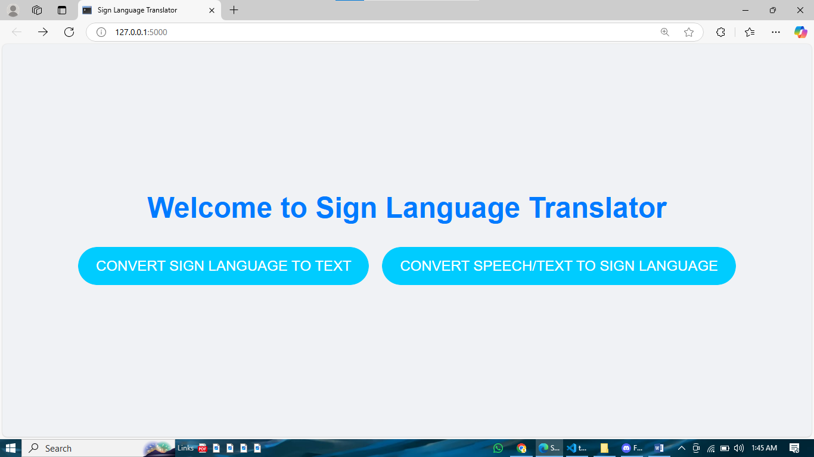
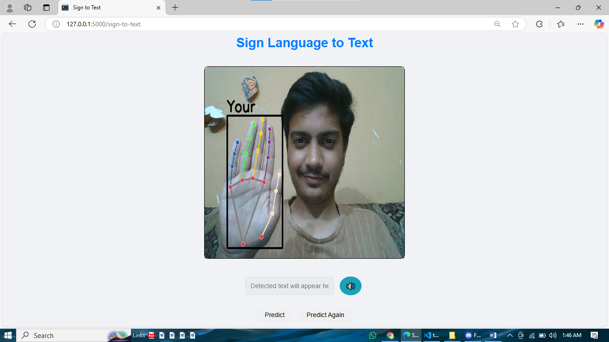
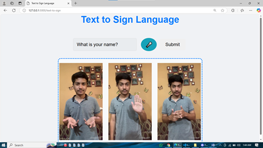

# Sign Language to Text and Text to Sign Language

This project addresses communication barriers by converting sign language gestures into structured text and vice versa, with additional functionalities like speech-to-text and text-to-speech. It is designed to help individuals communicate more effectively, particularly in situations involving hearing, speech, or visual impairments.

---

## Features
- **Real-Time Gesture Recognition**: Converts single and multi-hand gestures into text with high accuracy.
- **Text to Sign Conversion**: Displays sign language images corresponding to input text.
- **Speech Integration**: Includes speech-to-text and text-to-speech for enhanced usability.
- **Custom Dataset**: Built from scratch with over 14,000 images for 20 commonly used words.

---

## Methodology

### Dataset Creation
- Recorded videos of 20 commonly used words (e.g., "what," "your," "name").
- Extracted frames using OpenCV, creating ~14,000 labeled images.

### Feature Extraction
- Processed images with Mediapipe to extract x, y, z coordinates for 21 hand landmarks.
- Stored features in separate files for single and multi-hand signs (`single_hand.pkl` and `multi_hand.pkl`).

### Model Training
- Utilized Random Forest Classifiers for their simplicity and performance.
- Trained two models: `single.p` (single-hand signs) and `multi.p` (multi-hand signs).
- Incorporated z-coordinates to enhance depth information and reduce overfitting.

### Sign to Text Conversion
- Detects gestures in real time and extracts keywords.
- Utilizes the Gemini API to structure keywords into grammatically correct sentences.

### Text to Sign Conversion
- Filters text input to identify keywords.
- Maps keywords to corresponding sign images for display.

---

## Implementation

## User Interface

### Home Page
The home page provides an overview of the system's functionality.

### Sign to Text Page
This page performs real-time gesture recognition and converts signs into text.

### Text to Sign Page
This page converts input text into corresponding sign images.

---

## Tools and Technologies
- **Mediapipe**: For hand landmark detection.
- **OpenCV (cv2)**: For image processing and frame extraction.
- **Random Forest Classifier**: For training gesture recognition models.
- **Flask**: For developing the web-based user interface.
- **Gemini API**: For sentence structuring.

---

## Challenges and Solutions
### Challenges
1. Overfitting due to similar-looking gestures.
2. Lack of public datasets for specific sign language words.

### Solutions
1. Created separate models for single-hand and multi-hand gestures.
2. Enhanced feature extraction by adding z-coordinates for spatial depth.

---

## Future Scope
- Expand vocabulary to include more words.
- Add multilingual support.
- Integrate with wearable devices for portability.

